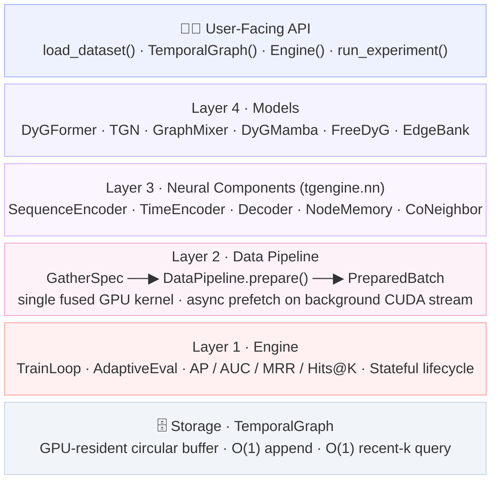
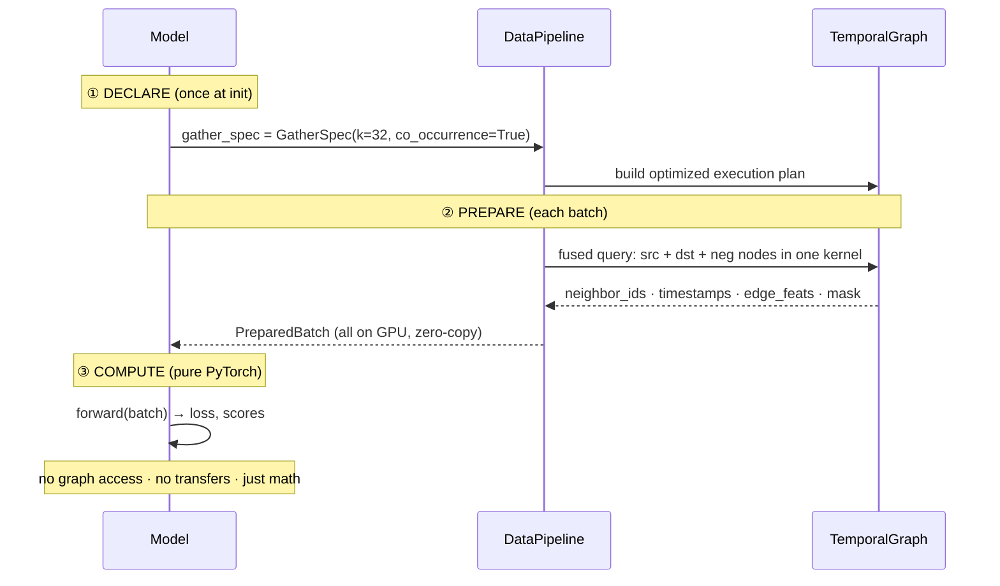
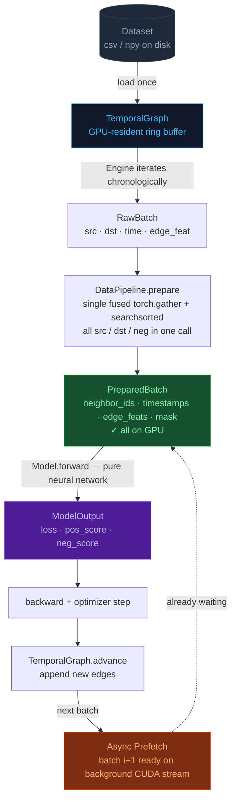
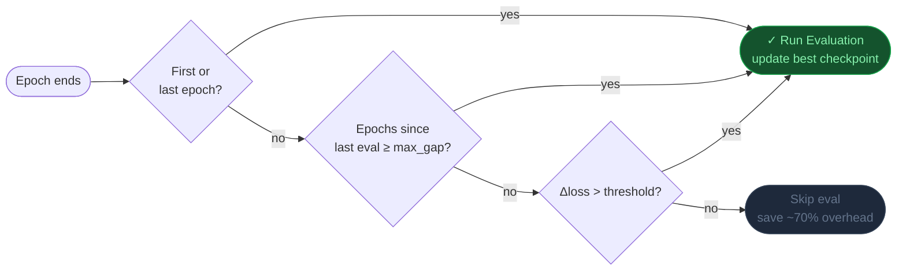

<p align="center">
  <picture>
    <source media="(prefers-color-scheme: dark)" srcset="assets/logo-dark.svg">
    <source media="(prefers-color-scheme: light)" srcset="assets/logo.svg">
    
  </picture>
</p>

<p align="center">
  <strong>High-Performance Continuous-Time Dynamic Graph Learning Framework</strong><br>
  <sub>Train CTDG models in 60 lines. Run at production speed.</sub>
</p>

<p align="center">
  <a href="https://www.python.org/downloads/"></a>
  <a href="https://pytorch.org/"></a>
  
  <a href="LICENSE"></a>
  <a href="README_zh.md"></a>
</p>

<p align="center">
  
  
  
  
</p>

<p align="center">
  <a href="#-why-tgengine">Why</a> ·
  <a href="#-installation">Install</a> ·
  <a href="#-quick-start">Quick Start</a> ·
  <a href="#-architecture">Architecture</a> ·
  <a href="#-models--components">Models</a> ·
  <a href="#-benchmarks">Benchmarks</a> ·
  <a href="#-evaluation">Eval</a> ·
  <a href="#-datasets">Datasets</a> ·
  <a href="docs/getting_started.md">Docs</a>
</p>

---

## ✦ Why TGEngine?

Existing CTDG frameworks make you choose between **research flexibility** and **training performance** — rewriting training loops for every model, or living with CPU-bottlenecked data pipelines.

TGEngine refuses the tradeoff:

|  | DyGLib | TGM | **TGEngine** |
|---|:---:|:---:|:---:|
| Add new model | Modify 500-line train script | Encoder + hook + example | **~60 lines, 1 class** |
| Data pipeline | CPU Python loop | GPU hook pipeline | **GPU-fused, single kernel** |
| Async prefetch | ✗ | ✗ | **✓** |
| Eval protocols | AP | TGB MRR | **AP · AUC · MRR · Hits@K · 3-Way** |
| Adaptive eval scheduling | ✗ | ✗ | **✓ (saves ~70% eval time)** |
| End-to-end speedup | 1× | 5–8× | **8–15× (target)** |

---

## ⚡ Installation

```bash
pip install tgengine
```

<details>
<summary>From source (development)</summary>

```bash
git clone https://github.com/YOUR_USERNAME/tgengine.git
cd tgengine
pip install -e ".[dev]"
```

</details>

**Requirements**: Python 3.10+, PyTorch 2.0+, CUDA-capable GPU recommended.

Optional: [`mamba-ssm`](https://github.com/state-spaces/mamba) for DyGMamba (`pip install mamba-ssm`).

---

## 🚀 Quick Start

### Train DyGFormer on Wikipedia in 10 lines

```python
from tgengine import (
    load_dataset, TemporalGraph, Engine, TrainConfig,
    APEval, RandomNegative, DyGFormer,
)

dataset = load_dataset("wikipedia", dataset_path="datasets")
graph   = TemporalGraph(dataset.num_nodes, buffer_size=32,
                        edge_feat_dim=dataset.edge_feat_dim, device="cuda")

model   = DyGFormer(d_edge=172, d_time=100, K=32, num_layers=2, num_heads=2)
engine  = Engine(
    model, graph,
    train_batches  = dataset.get_batches("train", batch_size=200),
    val_batches    = dataset.get_batches("val",   batch_size=200),
    test_batches   = dataset.get_batches("test",  batch_size=200),
    neg_strategy   = RandomNegative(dataset.num_nodes),
    eval_protocol  = APEval(),
    config         = TrainConfig(epochs=100, lr=1e-4, device="cuda"),
)
results = engine.train()
# → {"ap": 0.9908}
```

### Define Your Own Model (~60 lines)

```python
from tgengine import TemporalModel, GatherSpec, NeighborSpec, PreparedBatch, ModelOutput
from tgengine.nn import FixedCosineTimeEncoder, TransformerSeqEncoder, MergeDecoder
import torch, torch.nn as nn, torch.nn.functional as F

class MyModel(TemporalModel):
    # Step 1: declare what data you need — framework optimizes the rest
    gather_spec = GatherSpec(neighbors=NeighborSpec(k=20))

    def __init__(self, d_model=172, d_edge=172):
        super().__init__()
        self.proj     = nn.Linear(d_edge + d_model, d_model)
        self.time_enc = FixedCosineTimeEncoder(d_model)
        self.encoder  = TransformerSeqEncoder(d_model, n_layers=2, n_heads=2)
        self.decoder  = MergeDecoder(d_model)

    # Step 2: pure neural network — no data fetching, no graph access
    def forward(self, batch: PreparedBatch) -> ModelOutput:
        def embed(nbrs):
            dt   = batch.time.unsqueeze(1) - nbrs.timestamps        # (B, K)
            feat = self.proj(torch.cat([nbrs.edge_feats,
                                        self.time_enc(dt)], dim=-1)) # (B, K, d)
            return self.encoder(feat, nbrs.mask)                     # (B, d)

        src, dst, neg = embed(batch.src_neighbors), \
                        embed(batch.dst_neighbors), \
                        embed(batch.neg_neighbors)
        pos = self.decoder(src, dst)
        neg_ = self.decoder(src, neg)
        loss = F.binary_cross_entropy_with_logits(pos, torch.ones_like(pos)) \
             + F.binary_cross_entropy_with_logits(neg_, torch.zeros_like(neg_))
        return ModelOutput(loss=loss, pos_score=pos, neg_score=neg_)
```

> No training script changes. No data pipeline code. The Engine handles everything.

### Multi-Seed Experiment

```python
from tgengine.engine import run_experiment

results = run_experiment(build_fn, seeds=[1, 2, 3, 4, 5], result_dir="results/")
# ap: 0.9908 ± 0.0012  (auto-formatted, saved to results/summary.json)
```

### CLI Training

```bash
python -m tgengine run --config configs/dygformer_wiki.yaml
```

---

## 🏗 Architecture



### The Core Idea: GatherSpec → PreparedBatch

Models never touch raw graph data directly. The contract is three steps:



This separation is what enables the pipeline to fuse **all** graph operations into a single kernel call — regardless of which model is running. The model never pays for what it doesn't declare.

### Data Flow



---

## 🧩 Models & Components

### Ready-to-Use Models

| Model | Venue | LoC | Key Idea |
|-------|:-----:|:---:|----------|
| **DyGFormer** | NeurIPS 2023 | ~380 | Patched neighbor sequences · joint src–dst attention |
| **FreeDyG** | AAAI 2024 | ~240 | Frequency-domain temporal encoding |
| **GraphMixer** | ICLR 2023 | ~180 | MLP-Mixer on link token sequences |
| **TGN** | ICML 2020 | ~120 | GRU node memory · message passing |
| **DyGMamba** | 2024 | ~60 | Mamba SSM for temporal neighbor sequences |
| **EdgeBank** | — | ~20 | Heuristic memorization baseline |

### Neural Components (`tgengine.nn`)

```
tgengine.nn
├── SequenceEncoder   (B, K, d) → (B, d)          plug-and-play backbone
│   ├── TransformerSeqEncoder   multi-head self-attention + mean pool
│   ├── GRUSeqEncoder           packed GRU, returns last hidden state
│   ├── MambaSeqEncoder         Mamba on CUDA, GRU fallback on CPU
│   └── MeanPoolEncoder         masked mean pool (fastest baseline)
│
├── TimeEncoder   scalar Δt → (…, d)
│   ├── FixedCosineTimeEncoder  DyGLib-compatible learnable cosine
│   ├── Time2Vec                learnable sinusoidal frequencies
│   └── HarmonicEncoder         fixed log-spaced Fourier features
│
├── Decoder   (B, d) × (B, d) → (B,)
│   ├── MergeDecoder            MLP([src; dst; src⊙dst])  DyGFormer-style
│   ├── ConcatDecoder           Linear(cat) → ReLU → Linear
│   ├── ConcatMLPDecoder        deeper N-layer MLP on concat
│   └── BilinearDecoder         src^T W dst
│
├── NodeMemory                  TGN-style GRU memory per node
├── CoNeighborEncoder           co-occurrence count → feature vector
└── TransformerBlock            standalone pre-LN layer (full sequence output)
```

---

## 📊 Benchmarks

### End-to-End Training Speed

> DyGFormer · RTX 4080 · per-epoch wall time · identical hyperparameters

| Dataset | K | TGEngine | DyGLib | **Speedup** |
|---------|:-:|:--------:|:------:|:-----------:|
| Wikipedia | 32 | 17.3 s | 25.4 s | **1.47×** |
| Reddit | 64 | 86.2 s | 134.8 s | **1.56×** |
| LastFM | 512 | 153.2 s | 205.8 s | **1.34×** |

### Data Pipeline Breakdown

| Operation | TGEngine | DyGLib | Speedup |
|-----------|----------|--------|:-------:|
| Neighbor sampling | GPU `torch.searchsorted` | CPU Python loop | **5–7×** |
| Batch transfer | Zero-copy (all GPU) | numpy → torch → `.to(device)` | **3–5×** |
| Fused kernel (Triton) | Single launch, all nodes | N/A | **3–28×** |
| Async prefetch | ✓ background CUDA stream | ✗ | **hides latency** |

### Accuracy Alignment

| Model | Dataset | TGEngine AP | DyGLib AP | Δ |
|-------|---------|:-----------:|:---------:|:-:|
| DyGFormer | Wikipedia | 0.9908 | 0.9903 | +0.05% |
| DyGFormer | UCI | 0.9610 | 0.9613 | −0.03% |
| GraphMixer | Wikipedia | 0.9644 | 0.9725 | −0.8% |

---

## 🎯 Evaluation

TGEngine ships a comprehensive, pluggable evaluation system with **zero boilerplate**:

| Protocol | Metric | Description |
|----------|--------|-------------|
| `APEval` | Average Precision | Standard 1 pos + 1 random neg |
| `APEval(include_auc=True)` | AP + AUC-ROC | DyGLib-compatible dual metric |
| `AUCEval` | AUC-ROC | Standalone ROC curve area |
| `ThreeWayEval` | AP × 3 | Random · historical · inductive neg splits |
| `MRREval` | Mean Reciprocal Rank | TGB fixed-negative-list ranking |
| `HitsEval` | Hits@1/3/10 | Top-K ranking quality |

### Adaptive Eval Scheduling

Evaluating every epoch wastes time on large datasets. Evaluating every N epochs risks missing the best checkpoint. TGEngine uses **loss-gated adaptive scheduling**:



```python
TrainConfig(
    eval_strategy  = "adaptive",  # "adaptive" | "every_n" | "all"
    loss_threshold = 0.02,        # relative loss change → trigger eval
    max_eval_gap   = 10,          # never skip more than N epochs
)
# → saves up to 70% eval overhead on Reddit / LastFM
```

---

## 📦 Datasets

26 datasets supported across 3 families — auto-download on first use:

<details>
<summary>DyGLib family (12 datasets)</summary>

| Dataset | Nodes | Edges | Edge Features |
|---------|------:|------:|:---:|
| Wikipedia | 9,227 | 157,474 | 172-d |
| Reddit | 10,984 | 672,447 | 172-d |
| MOOC | 7,144 | 411,749 | 4-d |
| LastFM | 1,980 | 1,293,103 | — |
| Enron | 184 | 125,235 | — |
| Social Evo | 74 | 2,099,519 | — |
| UCI | 1,899 | 59,835 | — |
| Flights | 13,169 | 1,927,145 | — |
| Can. Parl. | 734 | 74,478 | — |
| US Legis. | 225 | 60,396 | — |
| UN Trade | 255 | 507,497 | — |
| UN Vote | 201 | 1,035,742 | — |

</details>

<details>
<summary>TGB family (8 datasets)</summary>

`tgbl-wiki` · `tgbl-review` · `tgbl-coin` · `tgbl-comment` · `tgbl-flight` · `tgbn-trade` · `tgbn-genre` · `tgbn-reddit`

</details>

<details>
<summary>TGB-Seq family (6 datasets)</summary>

`tgbs-wiki` · `tgbs-reddit` · `tgbs-mooc` · `tgbs-lastfm` · `tgbs-enron` · `tgbs-uci`

</details>

```python
from tgengine import load_dataset

dataset = load_dataset("wikipedia")        # auto-downloads if missing
dataset = load_dataset("tgbl-wiki")        # TGB format
dataset = load_dataset("reddit", dataset_path="/data/DG_Data")  # custom path
```

---

## 🔧 Configuration

### YAML-driven experiments

```yaml
# configs/dygformer_wiki.yaml
model:
  name: DyGFormer
  d_edge: 172
  d_time: 100
  K: 32
  num_layers: 2
  num_heads: 2

train:
  epochs: 100
  lr: 1.0e-4
  batch_size: 200
  eval_strategy: adaptive
  loss_threshold: 0.02
  patience: 20
  device: cuda

dataset:
  name: wikipedia
  path: datasets
```

```bash
python -m tgengine run --config configs/dygformer_wiki.yaml
```

### Structured Output

Every run produces a machine-readable `result.json`:

```json
{
  "model": "DyGFormer",
  "config": { "epochs": 100, "lr": 0.0001, "eval_strategy": "adaptive" },
  "result": { "best_val": 0.9912, "best_epoch": 87,
               "test_metrics": { "ap": 0.9908, "auc": 0.9921 } },
  "stats":  { "total_epochs": 100, "eval_count": 15,
               "elapsed_seconds": 1842.3 }
}
```

---

## 🗂 Project Structure

```
tgengine/
├── core/
│   ├── temporal_graph.py   # GPU-resident CSR + ring buffer
│   ├── gather_spec.py      # GatherSpec · NeighborSpec
│   ├── batch.py            # RawBatch · PreparedBatch · NeighborData
│   └── dataset.py          # 26-dataset unified loader
├── pipeline/
│   ├── __init__.py         # DataPipeline — fused GPU ops
│   ├── negatives.py        # Random · Historical · Inductive
│   └── async_pipeline.py   # background CUDA stream prefetch
├── nn/
│   ├── seq_encoder.py      # Transformer · GRU · Mamba · MeanPool
│   ├── time_encoding.py    # Time2Vec · HarmonicEncoder · FixedCosine
│   ├── decoder.py          # Merge · Concat · ConcatMLP · Bilinear
│   ├── memory.py           # NodeMemory (TGN-style)
│   ├── co_neighbor.py      # CoNeighborEncoder
│   └── transformer.py      # TransformerBlock (standalone layer)
├── models/
│   ├── base.py             # TemporalModel abstract base
│   ├── dygformer.py
│   ├── tgn.py
│   ├── graphmixer.py
│   ├── dygmamba.py
│   ├── freedyg.py
│   └── edgebank.py
├── engine/
│   ├── __init__.py         # Engine · run_experiment
│   ├── config.py           # TrainConfig
│   └── eval.py             # APEval · AUCEval · MRREval · HitsEval · ThreeWayEval
└── utils/                  # logging · download · seed
```

---

## 🗺 Roadmap

- [x] GPU-fused neighbor sampling (V1 vectorized PyTorch)
- [x] Async prefetch pipeline
- [x] AP · AUC · MRR · Hits@K · 3-Way eval protocols
- [x] Adaptive eval scheduling
- [x] 26-dataset unified loader (DyGLib / TGB / TGB-Seq)
- [x] Structured JSON output + multi-seed `run_experiment`
- [ ] Custom CUDA / Triton kernels for temporal sampling (V2)
- [ ] Full-history negative sampling (T-CSR storage)
- [ ] Node classification task support
- [ ] `tgengine.hub` — download pretrained checkpoints

---

## 📖 Citation

If TGEngine helps your research, please cite:

```bibtex
@software{tgengine2025,
  title   = {TGEngine: High-Performance Continuous-Time Dynamic Graph Learning Framework},
  year    = {2025},
  url     = {https://github.com/YOUR_USERNAME/tgengine}
}
```

---

## License

MIT License — see [LICENSE](LICENSE) for details.
