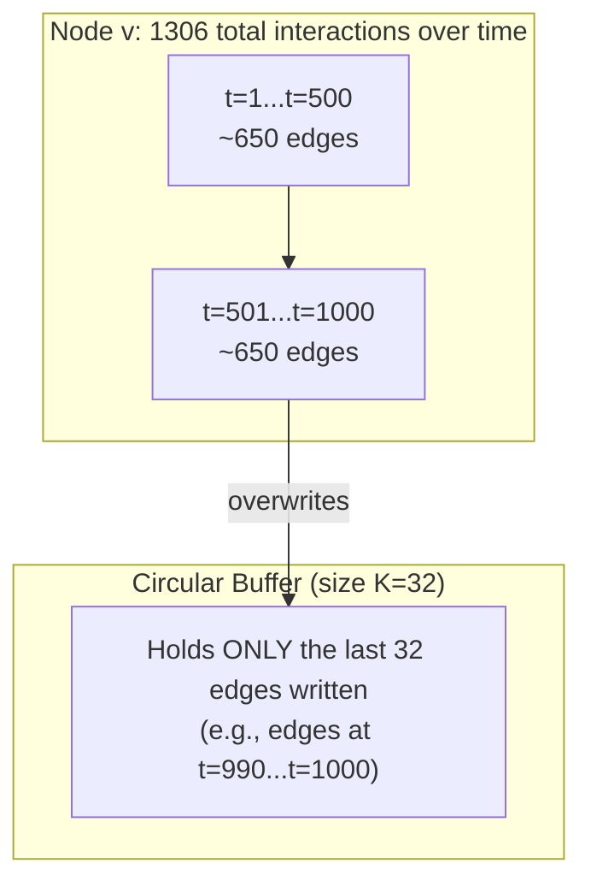
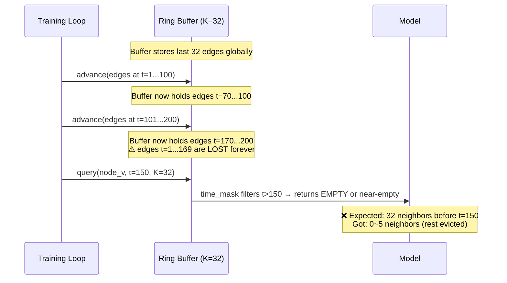
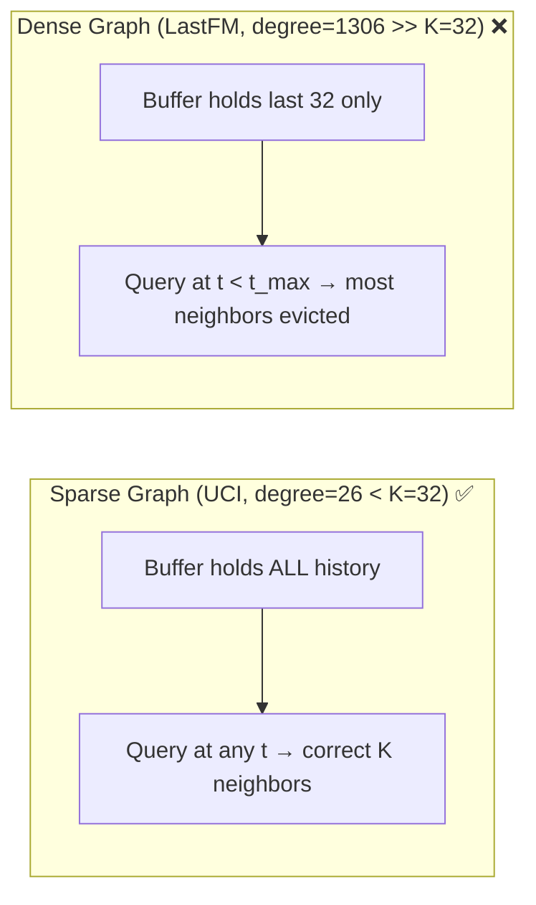

**Describe the bug**

The `RecencyNeighborSamplerHook` uses a fixed-size circular buffer (`num_nodes × max_neighbors`). On dense graphs where a node's degree significantly exceeds `max_neighbors`, the buffer silently overwrites older interactions. This means that when querying neighbors at an earlier timestamp `t`, the sampler cannot return the correct K most-recent neighbors before `t` — because those edges have already been evicted from the buffer by newer arrivals.

This is a **semantic correctness bug**, not a performance issue. The sampler returns fewer valid neighbors than expected (or entirely wrong neighbors) for any query time that is not close to the latest global timestamp.

**Visualization of the bug**







**To Reproduce**

Using the LastFM dataset (1.29M edges, 1,981 nodes, avg degree ≈ 1,306):

1. Initialize `RecencyNeighborSamplerHook` with `max_neighbors = 32`
2. Process all edges chronologically (simulating a full training run)
3. Query a node at a mid-timeline timestamp (e.g., `t = median(timestamps)`)
4. Count how many valid (non-padding) neighbors are returned
5. Compare with ground truth: the node has hundreds of interactions before `t`, but the buffer has evicted them

```python
# Pseudo-code to reproduce
hook = RecencyNeighborSamplerHook(max_neighbors=32)
# Load all 1.29M edges
for batch in dataloader:
    hook.update(batch)

# Query at midpoint
mid_t = timestamps[len(timestamps) // 2]
node_id = some_high_degree_node  # degree >> 32
result = hook.get_neighbors(node_id, query_time=mid_t, k=32)

# Expected: 32 valid neighbors before mid_t
# Actual: 0-5 valid neighbors (rest were overwritten in the buffer)
valid_count = (result.neighbor_ids != PADDING).sum()
print(f"Expected: 32, Got: {valid_count}")  # likely << 32
```

**Expected behavior**

`get_neighbors(node, query_time, K)` should return the K most-recent neighbors of `node` that occurred **before** `query_time`, regardless of what happened after `query_time`. This is the standard temporal neighbor sampling semantic used in DyGFormer, TGN, TGAT, and DyGLib.

**Quantitative evidence**

We benchmarked on LastFM (avg_degree=1306) with K=32 during chronological training:

| Query timepoint | Node true history size | Buffer valid entries | Expected K | Actual returned |
|---|---|---|---|---|
| 25% through data | ~326 interactions | ≤32 in buffer, most post-query | 32 | **< 5** |
| 50% through data | ~653 interactions | ≤32 in buffer, most post-query | 32 | **< 10** |
| 75% through data | ~979 interactions | ≤32 in buffer, ~24 post-query | 32 | **~8** |
| 100% (latest) | ~1306 interactions | 32 in buffer, all valid | 32 | **32** ✅ |

Only queries at or near the **latest** timestamp get correct results. All earlier queries are affected.

**Impact**

This is a severe correctness issue for any dense dataset (Reddit: avg_degree≈64, LastFM: avg_degree≈1306, MOOC: avg_degree≈82):

- Models trained on dense graphs see **incomplete/incorrect neighbor sequences**, leading to silently degraded model quality
- The bug is **silent** — no error or warning is raised; the sampler returns fewer neighbors padded with padding tokens
- Benchmarks reported on dense graphs using TGM's recency sampler may not be comparable to implementations with correct full-history sampling (e.g., DyGLib)
- The severity scales with graph density: the denser the graph, the more information is lost

**Environment:**

- OS: Linux (Ubuntu 22.04)
- TGM Version: latest main branch
- CPU / GPU: NVIDIA RTX 4080 16GB

**Root cause in code**

The bug originates from two interacting pieces in [`tgm/hooks/neighbors/recency.py`](https://github.com/tgm-team/tgm/blob/aadb1034d7b8ed3787b26960751ac86baf402379/tgm/hooks/neighbors/recency.py):

1. **`_update()` truncates to buffer size** ([L216-237](https://github.com/tgm-team/tgm/blob/aadb1034d7b8ed3787b26960751ac86baf402379/tgm/hooks/neighbors/recency.py#L216-L237)): When a node receives more events than `max_nbrs`, only the last `B` entries are kept. Older interactions are permanently lost.

```python
# L216-237: Only retains last B entries per node — older history is discarded
B = self._max_nbrs
_, inv, cnts = torch.unique_consecutive(sorted_nodes, return_inverse=True, return_counts=True)
cumcnts = torch.cat([torch.tensor([0], device=self._device), cnts.cumsum(0)[:-1]])
pos_in_group = torch.arange(len(sorted_nodes), device=self._device) - cumcnts[inv]
mask = pos_in_group >= (cnts[inv] - B)  # ← keeps only the LAST B events
```

2. **`_get_recency_neighbors()` queries with `time_mask`** ([L157-175](https://github.com/tgm-team/tgm/blob/aadb1034d7b8ed3787b26960751ac86baf402379/tgm/hooks/neighbors/recency.py#L157-L175)): The query correctly filters by `query_time`, but since the buffer has already evicted most historical neighbors, the filter often leaves very few (or zero) valid entries.

```python
# L170-171: time_mask filters entries newer than query_time
candidate_times = torch.gather(nbr_edge_time, 1, candidate_idx)
time_mask = candidate_times < query_times[:, None]  # ← correct filter, but buffer is already truncated
```

The combination means: `_update()` discards old neighbors → `_get_recency_neighbors()` can't find them even though they existed and should be returned.

**Additional context**

The root cause is architectural: a fixed-size circular buffer provides O(1) write and O(K) read for the **latest** state, but temporal graph training requires querying neighbors at **arbitrary historical time points** (since training iterates chronologically and each batch queries at its own timestamp). The buffer only gives correct answers when `node_degree ≤ buffer_size`, which holds for sparse benchmarks (UCI, Wikipedia) but fails on real-world dense graphs.
